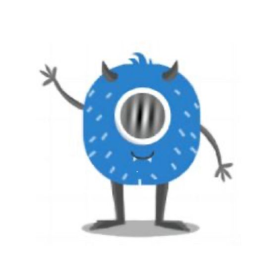

# 系统对齐对跨系统学习的促进作用研究实验

本代码开发了一个在线实验，旨在探究系统对齐对个体跨系统学习的促进作用。此实验的代码分为两个大的部分。第一部分（Part1）主要内容为实验总指导语呈现和实验刺激熟悉（包括Exp_Part1.html文件以及与之同目录下的scripts1/文件夹、styles1/文件夹、image1文件夹中的内容）；第二部分（Part2）为实验的主体，包括小人、房屋关系观察学习和配对任务（Exp_Part2/目录下的内容）。


## 如何使用代码

将jsPsych作业/ 目录下的文件复制到你的电脑中，双击打开Exp_Part1.html文件即可运行整个实验。


## Exp_Part1.html文件

第一部分主要内容为刺激熟悉阶段，呈现内容较为简单，主要为文字和图片，通过Exp_Part1.html文件描述这一部分网页的整体结构。


## scripts1/文件夹

-   实验指导语：通过 generalInstruction() 函数实现。
-   刺激熟悉阶段：按随机顺序呈现实验中的小人特征。
-   配对学习任务指导语：指导语结束后跳转到第二部分。

第一部分最后的内容为小人房屋配对学习任务的指导语，指导语呈现结束后跳转到实验的第二个部分（Part2）。

示例：

```
const displayImages = function() {
    const images = [
        './image/green.jpg'
];
}
```


## styles1/文件夹

styles1/文件夹中的exp1.css文件规定了第一部分实验中的文字和图片在网页中呈现的样式。

示例：

```
#head {
    text-align: center;
    font-size: 50px;
    margin-top: 5%;
}
```

```
function hideInstruction() {
        window.location.href = './html/Exp_Part2.html'; 
  }
```


## image1/文件夹

此文件夹中的图片为实验第一部分需要用到的刺激材料。

示例：


## Exp_Part2/文件夹

此文件夹为实验的第二部分（Part2）包含的文件。


### Exp_Part2.html文件

第二部分为实验的主体部分，包括小人和房屋配对关系的呈现以及被试手动匹配小人和房屋两个部分的内容，呈现内容较为丰富，对小人、房屋地图以及地图中房屋位置有着较为复杂的要求，通过Exp_Part2.html文件描述这一部分网页的整体结构。

示例：

```<div class="top-container">
 		<div id="P1" class="position"></div>
  </div>
```


### scripts2/文件夹

scripts2/文件夹中的exp2.js文件为实验第二部分（Part2）所需的javascript脚本。首先依次随机呈现6个小人和房屋地图中房屋的一一对应关系；重复进行两轮。在观察阶段，小人的颜色从绿变蓝对应着房屋位置在x轴方向上从左到右变化；小人的眼睛朝向由垂直到水平变化对应着房屋在y轴方向上从上到下变化。这一匹配关系通过函数displayCharacters()来实现。

在被试观察学习小人和房屋的对应关系后，进入选择任务。在选择任务指导语呈现完成后，被试需要根据出现的小人，选择其对应的房屋在地图中的位置。根据被试选择的结果提供其选择正确与否的反馈。被试选择完6个小人对应的房屋位置后，实验结束，进入结束语界面。

示例：

```
// 定义房屋在网格地图中的位置，使用[row, col]格式
const housePositions = [[1, 1], [6, 1], [3, 1], [1, 6], [3, 6], [1, 3]];
```
```
//选择正确与否的反馈
if (selectedRow === correctRow && selectedCol === correctCol) {
        feedback.textContent = "选择正确";
        choice.correct = true;
} else {
        feedback.textContent = "选择错误";
        highlightCorrectHouse(currentCharacter);
        choice.correct = false;
}
```


### styles2/文件夹

styles2/文件夹中的exp2.css文件规定了第二部分实验中的文字和刺激材料在网页中呈现的样式。

示例：

```
.container {
    display: flex;
    justify-content: center;
    align-items: center;
    flex-wrap: wrap;
    height: 100vh;
    visibility: hidden;
}
.left-container {
    display: flex;
    flex-direction: column;
    align-items: center;
    margin-right: 20px;
    order:1;
    flex-grow: 2;
}
.right-container {
    display: flex;
    align-items: center;
    order:2;
}
```


### image2/文件夹

此文件夹中的图片为实验第二部分需要用到的刺激材料。

示例：


